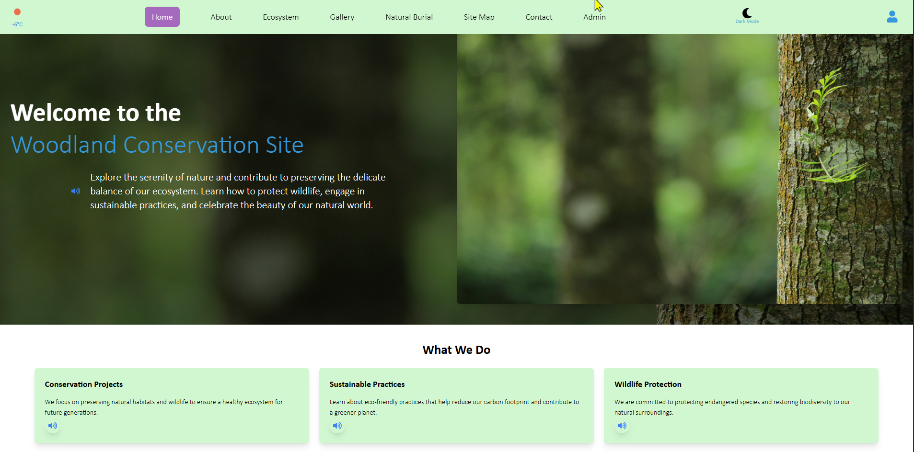
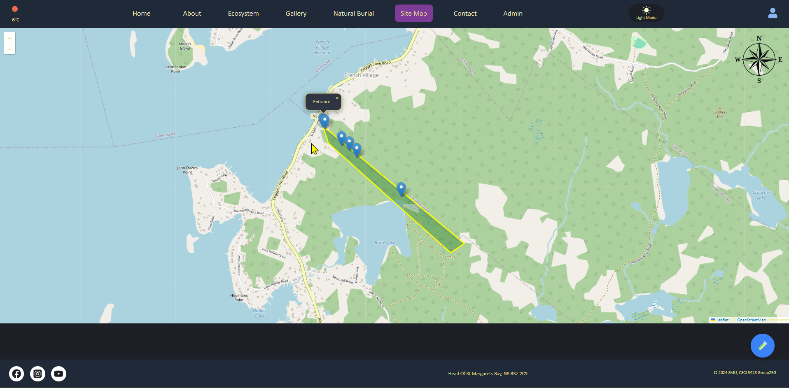
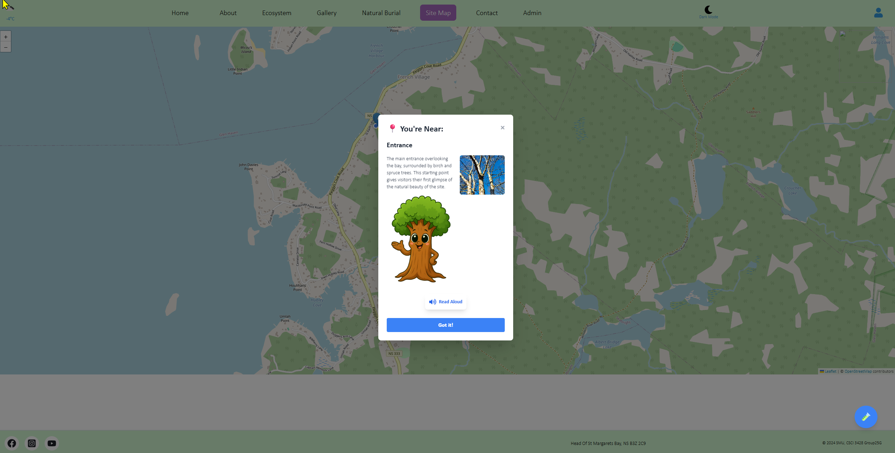

#Woodland Conservation Site Group Project.

#Overview
* Group project from my software engineering class. This project demonstrates my ability to use HTML, JavaScript, API integrations and work in a team in an agile        framework. 

#Tech
 * languages:  JavaScript, HTML, CSS
 * Frameworks: React, Vite, Tailwind CSS
 * APIs: Leaflet mapping tool

#Screenshots
* 
* 
* 

#Key Features(that I contributed to)
 * Implemented accessibility standards for user with low vision/hearing
 * Implemented mapping API with TTS based on the user's location

#How to Run
* Prerequisite: make sure you have npm installed
* Install dependencies: Do the following in terminal:
    - npm install (make sure to just write "npm install" and nothing else)
* Run the app: Terminal
    - npm run dev

#credits
* this website was originally developed as a student project for Saint Mary's University in collaboration with the French Village Conservation Woodland. but has been heavily modified for a portfolio
* Visual assets from the original academic version have been removed or replaced by pixabay images due to licensing restrictions

